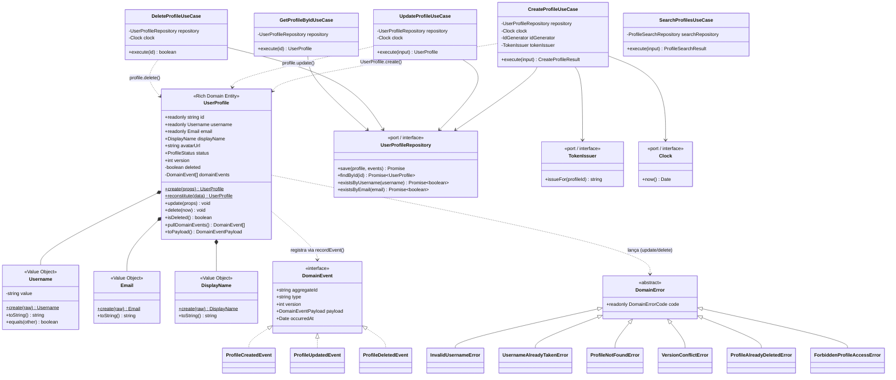
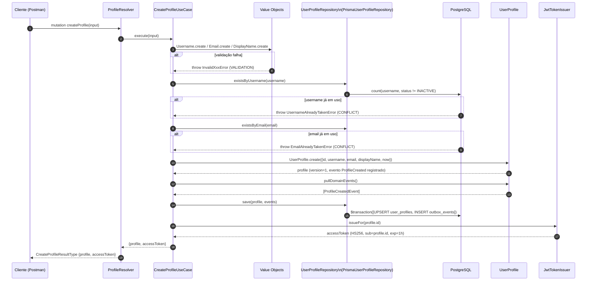
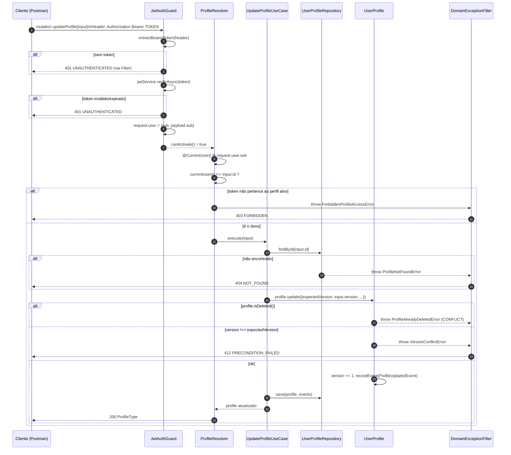
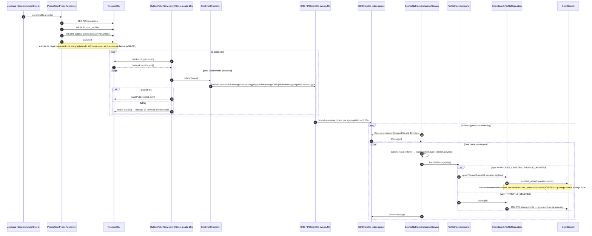
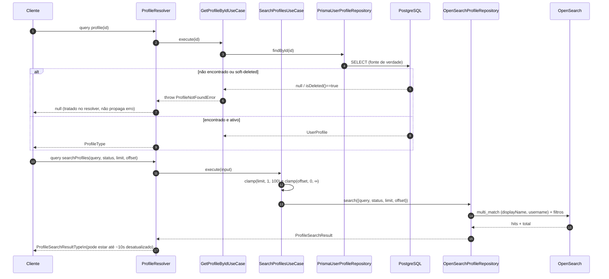
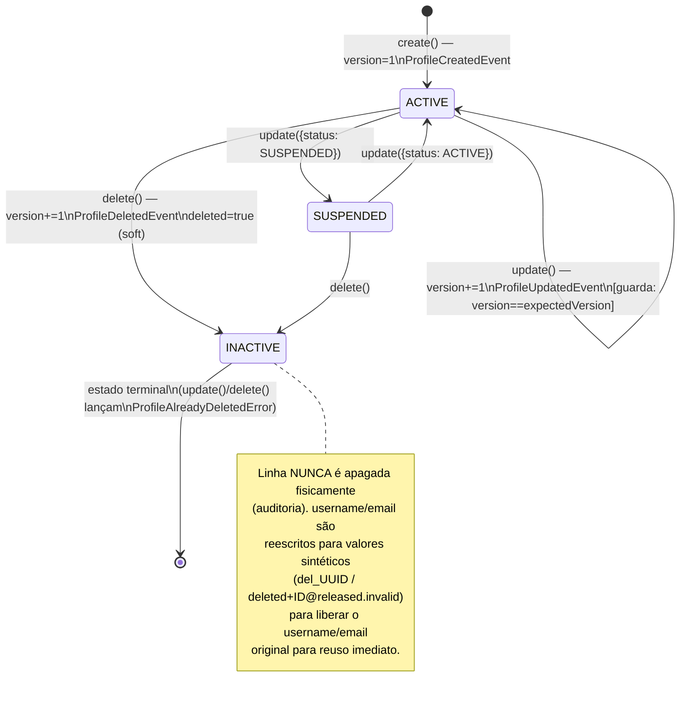
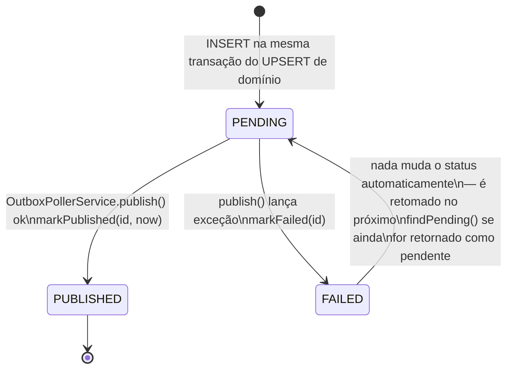
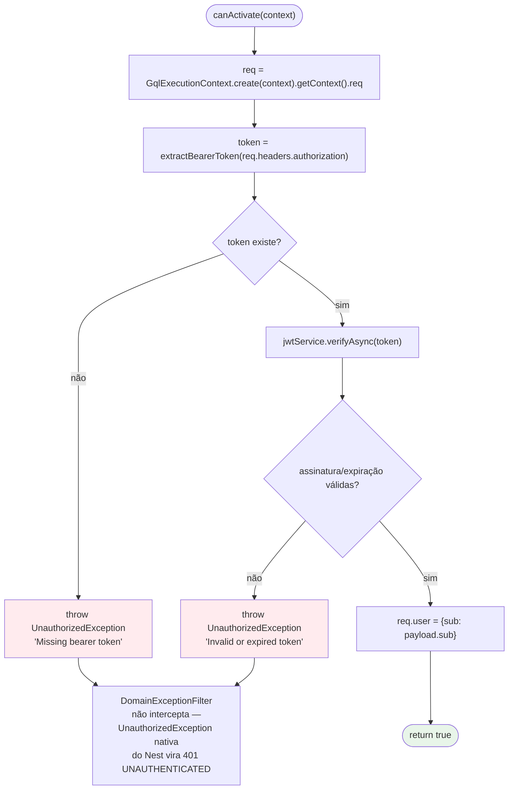

# Fluxograma da Aplicação — Profile Service

**Repositório:** `microservice-nest/profile-service` · **Porta:** 3000 · **Protocolo:** GraphQL (síncrono) + Worker SQS (assíncrono)

Este documento descreve a aplicação inteira através de diagramas UML (componentes, classes,
sequência, atividades e estados), cada um seguido do **porquê** da decisão de design. Os
diagramas usam sintaxe [Mermaid](https://mermaid.js.org/) (renderizada nativamente pelo
GitHub/GitLab), seguindo notação UML 2.x. As decisões formais também estão registradas como ADRs
em [`docs/adr/`](./adr/); este documento as amarra visualmente ao fluxo real de execução.

---

## 1. Diagrama de componentes — Clean/Hexagonal Architecture

```mermaid
flowchart TB
    CLIENT["Cliente GraphQL\n(Postman / app)"]

    subgraph PRES["Presentation"]
        RESOLVER["ProfileResolver"]
        GUARD["JwtAuthGuard"]
        CURUSER["@CurrentUser decorator"]
        FILTER["DomainExceptionFilter"]
    end

    subgraph APPL["Application — 5 Use Cases + Portas"]
        UC_CREATE["CreateProfileUseCase"]
        UC_UPDATE["UpdateProfileUseCase"]
        UC_DELETE["DeleteProfileUseCase"]
        UC_GET["GetProfileByIdUseCase"]
        UC_SEARCH["SearchProfilesUseCase"]
        PORT_CLOCK["«port» Clock"]
        PORT_ID["«port» IdGenerator"]
        PORT_TOKEN["«port» TokenIssuer"]
    end

    subgraph DOM["Domain (núcleo — zero dependência de framework/infra)"]
        ENTITY["UserProfile\n(entidade rica)"]
        VOS["Value Objects\nUsername · Email · DisplayName"]
        EVENTS["Domain Events\nProfileCreated/Updated/Deleted"]
        ERRORS["Domain Errors\nVALIDATION/CONFLICT/NOT_FOUND/\nVERSION_CONFLICT/FORBIDDEN"]
        PORT_REPO["«port» UserProfileRepository"]
        PORT_SEARCH["«port» ProfileSearchRepository"]
        PORT_OUTBOX["«port» OutboxRepository"]
        PORT_PUB["«port» EventPublisher"]
    end

    subgraph INFRA["Infrastructure (adapters)"]
        PRISMA["PrismaUserProfileRepository\n+ PrismaOutboxRepository"]
        OS_REPO["OpenSearchProfileRepository"]
        SNS_PUB["SnsEventPublisher"]
        JWT_ISSUER["JwtTokenIssuer"]
        OUTBOX_POLLER["OutboxPollerService\n@Cron 10s"]
        SQS_CONSUMER["SqsProfileIndexConsumerService"]
        IDX_CONSUMER["ProfileIndexConsumer"]
    end

    PG[("PostgreSQL\nuser_profiles + outbox_events")]
    OS[("OpenSearch\níndice profiles-v1")]
    SNSQ["SNS FIFO profile-events.fifo\n→ SQS profile-index-queue"]

    CLIENT --> RESOLVER
    RESOLVER --> GUARD
    GUARD --> CURUSER
    RESOLVER --> UC_CREATE
    RESOLVER --> UC_UPDATE
    RESOLVER --> UC_DELETE
    RESOLVER --> UC_GET
    RESOLVER --> UC_SEARCH
    RESOLVER -.->|erro de domínio| FILTER

    UC_CREATE --> ENTITY
    UC_CREATE --> PORT_REPO
    UC_CREATE --> PORT_CLOCK
    UC_CREATE --> PORT_ID
    UC_CREATE --> PORT_TOKEN
    UC_UPDATE --> PORT_REPO
    UC_DELETE --> PORT_REPO
    UC_GET --> PORT_REPO
    UC_SEARCH --> PORT_SEARCH

    ENTITY --> VOS
    ENTITY --> EVENTS
    ENTITY -.->|lança| ERRORS

    PORT_REPO -.impl.-> PRISMA
    PORT_SEARCH -.impl.-> OS_REPO
    PORT_OUTBOX -.impl.-> PRISMA
    PORT_PUB -.impl.-> SNS_PUB
    PORT_TOKEN -.impl.-> JWT_ISSUER

    PRISMA --> PG
    OUTBOX_POLLER --> PORT_OUTBOX
    OUTBOX_POLLER --> PORT_PUB
    SNS_PUB --> SNSQ
    SQS_CONSUMER --> SNSQ
    SQS_CONSUMER --> IDX_CONSUMER
    IDX_CONSUMER --> PORT_SEARCH
    OS_REPO --> OS

    style DOM fill:#e8f5e9,stroke:#2e7d32
    style APPL fill:#e3f2fd,stroke:#1565c0
    style PRES fill:#fff3e0,stroke:#e65100
    style INFRA fill:#fce4ec,stroke:#ad1457
```

**Por quê Ports & Adapters aqui, e não a arquitetura modular simples usada no `cyberalert`?**
Este serviço tem duas fontes de persistência com consistência diferente (Postgres forte,
OpenSearch eventual), um mecanismo de propagação assíncrona (outbox → SNS → SQS) e regras de
negócio não triviais (bloqueio otimista, soft-delete com liberação de username). Isolar o domínio
via portas permite testar `UserProfile`, os 5 use cases e as regras de negócio **sem** subir
Postgres/OpenSearch/LocalStack — e trocar a implementação de busca (ex.: outro motor além do
OpenSearch) sem tocar em `application/` ou `domain/`. A regra de dependência (setas `-.impl.->`
sempre apontando de fora para dentro) é o que garante que `domain/` nunca importe Prisma, o AWS
SDK ou o cliente OpenSearch — verificável a olho em qualquer arquivo de `src/domain/`.

---

## 2. Diagrama de classes — domínio e aplicação

**Por quê `UserProfile` tem construtor `private` e fábricas estáticas (`create`/`reconstitute`)?**
Garante que **toda** instância nasce em um estado válido: `create()` é o único caminho para um
perfil novo (versão inicial = 1, evento `ProfileCreatedEvent` registrado automaticamente),
enquanto `reconstitute()` é usado exclusivamente pelo mapper de persistência para reidratar uma
linha do banco em uma entidade — sem gerar eventos de domínio (não é uma "criação" de novo, é uma
leitura). Um construtor público permitiria montar um `UserProfile` em estado inconsistente
(ex.: `version=0` sem evento correspondente).

**Por quê `update()`/`delete()` lançam exceção em vez de retornar `Result<T, Error>`?**
Consistência com o restante do codebase: `DomainError` é uma hierarquia tipada
(`DomainErrorCode` como discriminador), capturada uma única vez no limite da aplicação — o
`DomainExceptionFilter` no GraphQL (ver §6). Isso evita que cada use case precise checar e
repassar manualmente um objeto de erro, mantendo o código de orquestração enxuto (DRY).

**Por quê `TokenIssuer` é uma porta da camada de aplicação, não do domínio?**
`UserProfile` (domínio) não sabe o que é um JWT — emitir um token não é uma regra de negócio do
perfil, é uma preocupação de infraestrutura de segurança orientada a caso de uso (só
`CreateProfileUseCase` precisa emitir um token, no momento em que a identidade nasce). Colocar a
porta em `application/ports/` em vez de `domain/ports/` comunica exatamente esse escopo.

---

## 3. Diagrama de sequência — `createProfile` (identidade + emissão de JWT)

**Por quê `createProfile` não exige autenticação, mas devolve um token?**
Não existe um provedor de identidade separado neste workspace — `createProfile` **é** o ato de
nascimento da identidade. O token emitido aqui é a prova de posse daquele perfil para as próximas
chamadas (ver ADR-006). Isso resolve o problema de autenticação sem exigir um serviço de login
adicional, ao custo de não haver conceito de uma pessoa dona de múltiplos perfis.

---

## 4. Diagrama de sequência — `updateProfile` / `deleteProfile` (guarda + ownership + lock otimista)

**Por quê a checagem de ownership (`currentUserId !== input.id`) acontece no `ProfileResolver`, e
não dentro do `UpdateProfileUseCase`?**
O `JwtAuthGuard` e o conceito de "usuário autenticado atual" são preocupações de transporte
(GraphQL/JWT) — a camada de aplicação (`UseCase`) não deveria saber que existe um "chamador
autenticado" além do id do recurso que está manipulando. Colocar a checagem no resolver mantém o
`UpdateProfileUseCase`/`DeleteProfileUseCase` reutilizáveis por qualquer transporte futuro (ex.:
uma mutação administrativa interna sem guard) sem duplicar a regra de autorização — e mantém o
domínio livre de qualquer noção de "quem está logado".

**Por quê a checagem de ownership acontece antes de chamar o use case, e não depois?**
Fail-fast: evita uma consulta ao banco (`findById`) para um chamador que já sabemos, só pelo
token, que não tem permissão — tanto por eficiência quanto para não vazar, via timing ou efeitos
colaterais, se o recurso existe antes mesmo de confirmar a autorização.

**Por quê lock otimista (`version`) em vez de lock pessimista (`SELECT ... FOR UPDATE`)?**
GraphQL mutations são requisições HTTP independentes e potencialmente concorrentes vindas de
clientes diferentes; segurar uma transação de banco aberta entre o `findById` e o `save` (lock
pessimista) amarraria uma conexão de pool pelo tempo de ida-e-volta da requisição inteira. O
padrão `version` incrementado a cada `update()`/`delete()` detecta o conflito na escrita
(`VersionConflictError`) sem bloquear leituras concorrentes — o cliente decide se tenta de novo.

---

## 5. Diagrama de sequência — Transactional Outbox → SNS FIFO → SQS → OpenSearch (CQRS assíncrono)

**Por quê Transactional Outbox em vez de publicar no SNS diretamente dentro do use case (dual
write)?**
Se o use case escrevesse no Postgres e chamasse `sns.publish()` como duas operações
independentes, uma falha entre elas (crash do processo, timeout de rede) deixaria o Postgres
atualizado mas o índice de busca **eternamente** desatualizado, sem qualquer sinal de erro. O
outbox transforma a publicação em um efeito colateral de uma linha já commitada — o poller só
publica o que sabe ter sido persistido com sucesso, e reitera (`FAILED` → tentado de novo) até
conseguir (ADR-001).

**Por quê SNS FIFO (`MessageGroupId=aggregateId`) em vez de um tópico standard?**
Um mesmo perfil pode ser criado e imediatamente atualizado; sem ordem garantida, o SQS poderia
entregar o evento de update antes do de create, ou entregar updates fora de ordem. O
`MessageGroupId=aggregateId` garante ordenação **por perfil** (perfis diferentes continuam
paralelos entre si), e `MessageDeduplicationId=aggregateId:version:type` faz o SNS descartar
publicações duplicadas do mesmo evento.

**Por quê o script de upsert do OpenSearch (`upsertVersionAware`) ainda compara versão, se o SNS
já é FIFO?**
Defesa em profundidade: FIFO garante ordem *dentro do SNS/SQS*, mas o consumidor pode reprocessar
uma mensagen antiga após um restart, um redrive de DLQ, ou uma race entre múltiplos workers. A
comparação `params.doc.version > ctx._source.version` no script Painless torna a indexação
**idempotente e comutativa** — não importa a ordem física de chegada no OpenSearch, o resultado
final converge para o estado da versão mais alta já vista (ADR-003).

---

## 6. Diagrama de sequência — leituras (consistência forte vs. eventual)

**Por quê `profile(id)` lê do Postgres e `searchProfiles` lê do OpenSearch — CQRS?**
São necessidades de leitura fundamentalmente diferentes: busca por id precisa de consistência
forte (acabou de criar, tem que aparecer imediatamente — ex.: o próprio fluxo de
`createProfile`→`updateProfile` do Postman depende disso) enquanto busca textual precisa de um
motor de full-text que o Postgres não oferece nativamente com a mesma qualidade. Separar os
modelos de leitura evita o pior dos dois mundos (usar Postgres para busca textual pobre, ou
esperar o OpenSearch de cada leitura por id) (ADR-002).

**Por quê o limite de `searchProfiles` é clampado (`1..100`) em vez de aceitar qualquer valor?**
Hardening contra exaustão de recursos: sem teto, um cliente (malicioso ou não) poderia pedir
`limit=1000000` e forçar uma consulta cara no OpenSearch. O clamp é aplicado na camada de
aplicação (`SearchProfilesUseCase`), não no resolver, para valer também se um outro transporte
futuro chamar o mesmo use case diretamente.

---

## 7. Diagrama de estados — ciclo de vida de `UserProfile`

**Por quê `INACTIVE` é terminal (não existe "reativar" um perfil deletado)?**
Semântica de soft-delete como operação irreversível pela API pública — uma vez deletado, um novo
perfil com o mesmo username é uma **nova** identidade (novo `id`, nova linha), não uma
reativação da antiga. Isso mantém o modelo de eventos simples: `ProfileDeletedEvent` é sempre o
último evento de um agregado.

**Por quê reescrever `username`/`email` em vez de deixá-los como estavam?**
Ambas as colunas têm constraint `unique` no Postgres. Um soft-delete que preservasse os valores
originais bloquearia permanentemente aquele username para qualquer outra pessoa — mesmo o próprio
dono não conseguiria "recriar" o perfil com o mesmo nome. `toPersistedUsername()`/
`toPersistedEmail()` (em `profile.mapper.ts`) resolvem isso reescrevendo para um valor sintético
não colidente só na hora de persistir (a entidade de domínio em memória mantém os valores
originais — a reescrita é uma preocupação de infraestrutura/persistência, não do domínio).
`existsByUsername()`/`existsByEmail()` filtram `status != INACTIVE`, então a checagem de conflito
do `CreateProfileUseCase` nunca "vê" as linhas soft-deletadas.

---

## 8. Diagrama de estados — `OutboxEvent`

**Nota sobre `FAILED`:** no código atual, `markFailed` grava `status=FAILED`, mas
`findPending()` só seleciona `status=PENDING` — ou seja, um evento marcado `FAILED` **não** é
automaticamente reprocessado pelo poller no estado atual da implementação; fica retido para
inspeção/republicação manual. Isso é uma escolha conservadora: preferir um evento "preso" e visível
a reprocessá-lo indefinidamente sem limite de tentativas (o que arriscaria um hot-loop de
publish se a falha for persistente, ex.: `SNS_TOPIC_ARN` mal configurado).

---

## 9. Diagrama de atividades — `JwtAuthGuard.canActivate()`

**Por quê um `JwtAuthGuard` próprio em vez de `@nestjs/passport` + `passport-jwt`?**
KISS: a necessidade é estritamente "verificar assinatura/validade do token e extrair `sub`" — não
há múltiplas estratégias de autenticação (OAuth, local, etc.) que justifiquem a indireção do
Passport (`Strategy`, `AuthGuard('jwt')`, serialização de sessão). Um `CanActivate` de ~30 linhas
usando `JwtService.verifyAsync` diretamente é mais fácil de auditar e testar unitariamente do que
uma estratégia Passport equivalente, sem perder nenhuma garantia de segurança.

---

## 10. Tabela-resumo de decisões de design ("porquês") e ADRs relacionadas

| Decisão | Alternativa descartada | Motivo | ADR |
|---|---|---|---|
| Transactional Outbox para propagar eventos | Dual-write direto (Postgres + SNS) | Falha parcial deixaria o índice de busca desatualizado silenciosamente | [ADR-001](./adr/ADR-001-transactional-outbox.md) |
| CQRS: Postgres (escrita) / OpenSearch (leitura textual) | Um único banco para tudo | Necessidades de consistência e de capacidade de busca são diferentes | [ADR-002](./adr/ADR-002-cqrs-postgres-opensearch.md) |
| Indexação idempotente e version-aware (script Painless) | Confiar cegamente na ordem do SNS FIFO | SQS pode redriver/reprocessar; convergência precisa ser garantida na ponta | [ADR-003](./adr/ADR-003-idempotent-indexing.md) |
| Prisma como ORM de escrita | TypeORM (como no cyberalert) | Ver justificativa específica na ADR | [ADR-004](./adr/ADR-004-prisma-write-orm.md) |
| GraphQL code-first | Schema-first (SDL manual) | Contrato gerado a partir do código, revisável, sem duplicação de definição | [ADR-005](./adr/ADR-005-graphql-sdl-contract.md) |
| JWT + autorização por ownership (`sub == id` do alvo) | Sem autenticação / RBAC completo com serviço externo | Fecha o IDOR em `update`/`delete` sem exigir um provedor de identidade separado | [ADR-006](./adr/ADR-006-jwt-ownership-authorization.md) |
| Lock otimista via campo `version` | Lock pessimista (`SELECT FOR UPDATE`) | Não amarra conexões de pool durante o ciclo de vida de uma mutation GraphQL | — |
| Soft-delete com reescrita de username/email | Hard delete, ou soft-delete sem reescrita | Preserva auditoria E libera o username/email para reuso imediato | — |
| Checagem de ownership no resolver, antes do use case | Checagem dentro do use case | Mantém o domínio livre de "usuário autenticado"; fail-fast antes de tocar o banco | — |
| `JwtAuthGuard` próprio em vez de Passport | `@nestjs/passport` + `passport-jwt` | KISS — uma única estratégia de auth não justifica a indireção do Passport | — |

---

## 11. Referências de código

| Diagrama | Arquivos-fonte |
|---|---|
| Componentes / camadas | `src/profile.module.ts`, `src/profile.tokens.ts` |
| Classes — domínio | `src/domain/entities/user-profile.entity.ts`, `src/domain/value-objects/*.vo.ts`, `src/domain/events/profile.events.ts`, `src/domain/errors/domain.errors.ts`, `src/domain/ports/repositories.port.ts` |
| Classes — aplicação | `src/application/use-cases/*.use-case.ts`, `src/application/ports/application.port.ts` |
| Sequência — createProfile | `src/presentation/graphql/profile.resolver.ts`, `src/application/use-cases/create-profile.use-case.ts`, `src/infrastructure/auth/jwt-token.issuer.ts` |
| Sequência — update/delete + auth | `src/presentation/graphql/jwt-auth.guard.ts`, `src/presentation/graphql/current-user.decorator.ts`, `src/presentation/graphql/profile.resolver.ts`, `src/presentation/graphql/domain-exception.filter.ts` |
| Sequência — outbox → SNS → SQS → OpenSearch | `src/infrastructure/persistence/prisma-user-profile.repository.ts`, `src/infrastructure/messaging/outbox-poller.service.ts`, `src/infrastructure/messaging/sns-event.publisher.ts`, `src/infrastructure/messaging/sqs-profile-index.consumer.service.ts`, `src/infrastructure/messaging/profile-index.consumer.ts`, `src/infrastructure/search/opensearch-profile.repository.ts` |
| Estados — UserProfile / soft-delete | `src/domain/entities/user-profile.entity.ts`, `src/infrastructure/persistence/profile.mapper.ts` |
| Estados — OutboxEvent | `prisma/schema.prisma`, `src/infrastructure/messaging/outbox-poller.service.ts` |
| Atividades — JwtAuthGuard | `src/presentation/graphql/jwt-auth.guard.ts` |

Ver também: [`docs/adr/`](./adr/) (decisões formais), [`docs/ARCHITECTURE.md`](./ARCHITECTURE.md) (se aplicável), [`../../microservice-cyberalert/docs/TECHNICAL_OVERVIEW.md`](../../microservice-cyberalert/docs/TECHNICAL_OVERVIEW.md) (visão cruzada dos dois serviços) e [`../HOW_TO_RUN.md`](../HOW_TO_RUN.md) (como subir o serviço para testar no Postman).
